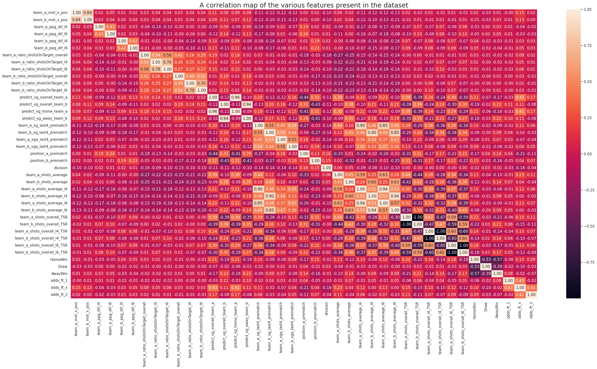
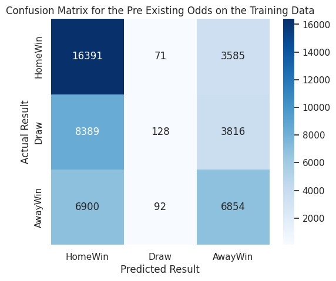
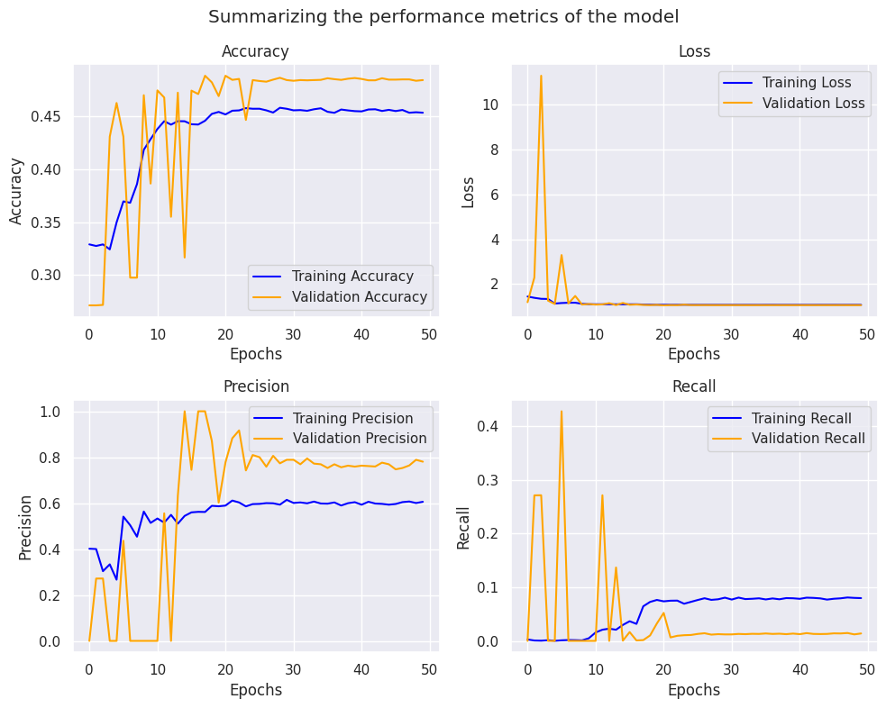
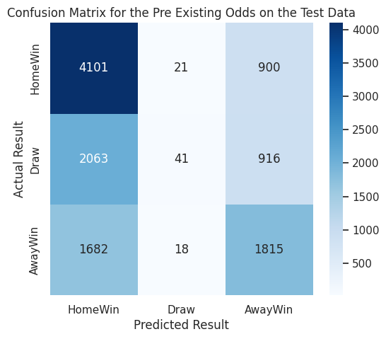
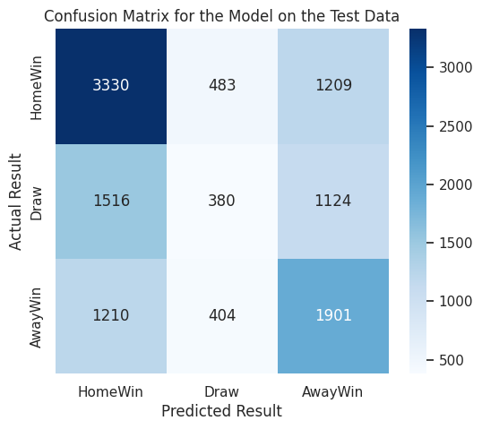

# Soccer Match Predictor

This project was inspired by this [Kaggle Competition](https://www.kaggle.com/competitions/prediction-of-results-in-soccer-matches/overview) which includes a detailed set of statistics for nearly 70 thousand soccer matches. The goal of this project is to predict whther the result of a given soccer match will be a `HomeWin`, `AwayWin`, or a `Draw` using these statistics.

This project aims to demonstrate a similar performance to the pre-game odds that are made by odds makers. For the given matches, those odds appear as additional columns in the dataset.

## Contributors
- [@Bardia Parmoun](https://github.com/bardia-p)
- [@Christopher Semaan](https://github.com/csemaan10)

## Data
As previously mentioned, the data for this project was taken from the following [Kaggle Competition](https://www.kaggle.com/competitions/prediction-of-results-in-soccer-matches/overview). We have also included local copies of the [training](Datasets/train_dataset.csv) and [test](Datasets/test_dataset.csv) datasets.

Here is a quick overview of the columns in the dataset:
| Item | Description |
| :--: | :---------- |
| id   | Unique identifier for each match. |
| team_a_mot_x_pos | Motivation of team A based on their position. |
| team_b_mot_x_pos | Motivation of team B based on their position. |
| team_a_ppg_dif_l4 | Points per game difference for team A in the last 4 matches. |
| team_a_ppg_dif_l6 | Points per game difference for team A in the last 6 matches. |
| team_b_ppg_dif_l4 | Points per game difference for team B in the last 4 matches. |
| team_b_ppg_dif_l6 | Points per game difference for team B in the last 6 matches. |
| team_a_ratio_shotsOnTarget_overall | Overall ratio of shots on target for team A. |
| team_a_ratio_shotsOnTarget_l4 | Ratio of shots on target for team A in the last 4 matches. |
| team_a_ratio_shotsOnTarget_l6 | Ratio of shots on target for team A in the last 6 matches. |
| team_b_ratio_shotsOnTarget_overall | Overall ratio of shots on target for team B. |
| team_b_ratio_shotsOnTarget_l4 | Ratio of shots on target for team B in the last 4 matches. |
| team_b_ratio_shotsOnTarget_l6 | Ratio of shots on target for team B in the last 6 matches. |
| odds_ft_1 | Betting odds for a home win. |
| odds_ft_x | Betting odds for a draw. |
| odds_ft_2 | Betting odds for an away win. |
| predict_xg_overall_team_a | Predicted total expected goals for team A. |
| predict_xg_overall_team_b | Predicted total expected goals for team B. |
| predict_xg_home_team_a | Predicted expected goals for team A at home. |
| predict_xg_away_team_b | Predicted expected goals for team B away. |
| team_a_xg_last4_prematch | Expected goals for team A in the last 4 matches. |
| team_b_xg_last4_prematch | Expected goals for team B in the last 4 matches. |
| team_a_xga_last4_prematch | Expected goals against for team A in the last 4 matches. |
| team_b_xga_last4_prematch | Expected goals against for team B in the last 4 matches. |
| position_a_prematch | League position of team A before the match. |
| position_b_prematch | League position of team B before the match. |
| HomeWin | Binary indicator (1 or 0) if the home team won. |
| Draw | Binary indicator (1 or 0) if the match was a draw. |
| AwayWin | Binary indicator (1 or 0) if the away team won. |
| division | Division or league in which the match is played. |
| team_a_shots_average | Average shots per match for team A. |
| team_b_shots_average | Average shots per match for team B. |
| team_a_shots_average_l4 | Average shots per match in the last 4 matches for team A. |
| team_b_shots_average_l4 | Average shots per match in the last 4 matches for team B. |
| team_a_shots_average_l6 | Average shots per match in the last 6 matches for team A. |
| team_b_shots_average_l6 | Average shots per match in the last 6 matches for team B. |
| team_a_shots_overall_TSR | Total Shooting Ratio for team A. |
| team_b_shots_overall_TSR | Total Shooting Ratio for team B. |
| team_a_shots_overall_l4_TSR | Total Shooting Ratio in the last 4 matches for team A. |
| team_b_shots_overall_l4_TSR | Total Shooting Ratio in the last 4 matches for team B. |
| team_a_shots_overall_l6_TSR | Total Shooting Ratio in the last 6 matches for team A. |
| team_b_shots_overall_l6_TSR | Total Shooting Ratio in the last 6 matches for team B. |
| profit_1 | Theoretical profit for betting on a home win. |
| profit_x | Theoretical profit for betting on a draw. |
| profit_2 | Theoretical profit for betting on an away win. |


## Pre-Processing
Here is a heatmap showcasing the relations between the columns in the dataset:
<p align="center">
  
</p>

To simplify the model training, the following columns since they are not features and do not affect the outcome at all:
- id
- profit_1
- profit_x
- profit_2

Additionally, the following odds columns were ignored since we want the model to compete with the existing odds makers:
- odds_ft_1
- odds_ft_x
- odds_ft_2

Finally, we decided to also remove the following features that we deemed unnecessary and possibly inaccurate due to the existence of other metrics. This analysis can be further verified using the heatmap:
- team_a_ratio_shotsOnTarget_l6
- team_a_ratio_shotsOnTarget_l4
- team_b_ratio_shotsOnTarget_l6
- team_b_ratio_shotsOnTarget_l4

## Design
For this project, we decided to use a Feedforward Neural Network (FNN). Our design is described in detail in the [project report](Documents/SYSC5108_ProjectReport_Group3.pdf).

Here is a summary of the model architecture:
```
Model: "sequential"

┏━━━━━━━━━━━━━━━━━━━━━━━━━━━━━━━━━━━━━━┳━━━━━━━━━━━━━━━━━━━━━━━━━━━━━┳━━━━━━━━━━━━━━━━━┓
┃ Layer (type)                         ┃ Output Shape                ┃         Param # ┃
┡━━━━━━━━━━━━━━━━━━━━━━━━━━━━━━━━━━━━━━╇━━━━━━━━━━━━━━━━━━━━━━━━━━━━━╇━━━━━━━━━━━━━━━━━┩
│ dense (Dense)                        │ (None, 64)                  │           2,048 │
├──────────────────────────────────────┼─────────────────────────────┼─────────────────┤
│ batch_normalization                  │ (None, 64)                  │             256 │
│ (BatchNormalization)                 │                             │                 │
├──────────────────────────────────────┼─────────────────────────────┼─────────────────┤
│ leaky_re_lu (LeakyReLU)              │ (None, 64)                  │               0 │
├──────────────────────────────────────┼─────────────────────────────┼─────────────────┤
│ dropout (Dropout)                    │ (None, 64)                  │               0 │
├──────────────────────────────────────┼─────────────────────────────┼─────────────────┤
│ dense_1 (Dense)                      │ (None, 32)                  │           2,080 │
├──────────────────────────────────────┼─────────────────────────────┼─────────────────┤
│ batch_normalization_1                │ (None, 32)                  │             128 │
│ (BatchNormalization)                 │                             │                 │
├──────────────────────────────────────┼─────────────────────────────┼─────────────────┤
│ leaky_re_lu_1 (LeakyReLU)            │ (None, 32)                  │               0 │
├──────────────────────────────────────┼─────────────────────────────┼─────────────────┤
│ dropout_1 (Dropout)                  │ (None, 32)                  │               0 │
├──────────────────────────────────────┼─────────────────────────────┼─────────────────┤
│ dense_2 (Dense)                      │ (None, 32)                  │           1,056 │
├──────────────────────────────────────┼─────────────────────────────┼─────────────────┤
│ batch_normalization_2                │ (None, 32)                  │             128 │
│ (BatchNormalization)                 │                             │                 │
├──────────────────────────────────────┼─────────────────────────────┼─────────────────┤
│ leaky_re_lu_2 (LeakyReLU)            │ (None, 32)                  │               0 │
├──────────────────────────────────────┼─────────────────────────────┼─────────────────┤
│ dropout_2 (Dropout)                  │ (None, 32)                  │               0 │
├──────────────────────────────────────┼─────────────────────────────┼─────────────────┤
│ dense_3 (Dense)                      │ (None, 16)                  │             528 │
├──────────────────────────────────────┼─────────────────────────────┼─────────────────┤
│ batch_normalization_3                │ (None, 16)                  │              64 │
│ (BatchNormalization)                 │                             │                 │
├──────────────────────────────────────┼─────────────────────────────┼─────────────────┤
│ leaky_re_lu_3 (LeakyReLU)            │ (None, 16)                  │               0 │
├──────────────────────────────────────┼─────────────────────────────┼─────────────────┤
│ dropout_3 (Dropout)                  │ (None, 16)                  │               0 │
├──────────────────────────────────────┼─────────────────────────────┼─────────────────┤
│ dense_4 (Dense)                      │ (None, 16)                  │             272 │
├──────────────────────────────────────┼─────────────────────────────┼─────────────────┤
│ batch_normalization_4                │ (None, 16)                  │              64 │
│ (BatchNormalization)                 │                             │                 │
├──────────────────────────────────────┼─────────────────────────────┼─────────────────┤
│ leaky_re_lu_4 (LeakyReLU)            │ (None, 16)                  │               0 │
├──────────────────────────────────────┼─────────────────────────────┼─────────────────┤
│ dropout_4 (Dropout)                  │ (None, 16)                  │               0 │
├──────────────────────────────────────┼─────────────────────────────┼─────────────────┤
│ dense_5 (Dense)                      │ (None, 3)                   │              51 │
└──────────────────────────────────────┴─────────────────────────────┴─────────────────┘

Total params: 6,675 (26.07 KB)
Trainable params: 6,355 (24.82 KB)
Non-trainable params: 320 (1.25 KB)
```

## Implementation
We used Jupyter notebooks for the [model](Model/soccer_predictions.ipynb). You can also find a saved version of model [here](Model/fnn_model.keras).

## Performance

To properly measure the performance of the model, an additional metrics called the net profit was used that is defined as follows:
```math
profit = \sum outcome\_odds \cdot correct\_outcome\_indicator - 1
```
This metric measures the total profit gain by the model if it were to bet on the most probable match outcome where `outcome_odds` is the odds associated with the chosen outcome and `correct_outcome_indicator` is whether the chosen outcome was correct or not (0 or 1). In other words, the model would always choose the smallest odds. We want this metric to be large as possible, however, it is usually close to zero (if not negative) due to the fact that the most probable outcome would have the smallest odds. 

### Training Performance
- **Existing odds:** applying the existing odds on the training data (choosing the smallest odds as the outcome) revealed that the odds only have an accuracy of **50.56%**. Here is a confusion matrix using just the odds:
<p align="center">
  
</p>

Using these odds, the model was able to achieve a total net profit of `$ -2401.60` out of `46226` games.

- **Model:** On the training data, the model was able to achieve an accuracy of **48.43%**. Here is a summary of the model's performance metrics:
<p align="center">
  
</p>

#### 5-Fold Cross Validation
Additionally, we performed 5-fold cross validation to get statistical measures for the accuracy of the model:

The model was able to achieve a mean F1 score of **0.4628** with a std deviation of **0.0158**.

Out of the `9245` matches used to testing in each fold, on average, the model was also able to achieve a mean profit of `$ -441.47` with a std deviation of `$122.94`. On these same matches, the pre existing odds, on average, achieved a mean profit of `$ -505.19` with a standard deviation of `$40.79`.

### Blind-Test Performance
Both the model and the existing odds were further tested on `11557` additional new matches. The results are as follows:

- **Existing odds:** The existing odds had an accuracy of **51.54%**. Here is a confusion matrix of the predictions using just the existing odds:
<p align="center">
  
</p>

The net profit obtained after using the existing odds is  `$ -330.72$`.

- **Model:** The model had an accuracy of **48.55%**. It also achieved an F1 micro average score of `0.4568` which is consistent with our predictions. Here is a confusion matrix of the predictions using the model:
<p align="center">
  
</p>

The net profit obtained after using the model is `$ -372.678`. 